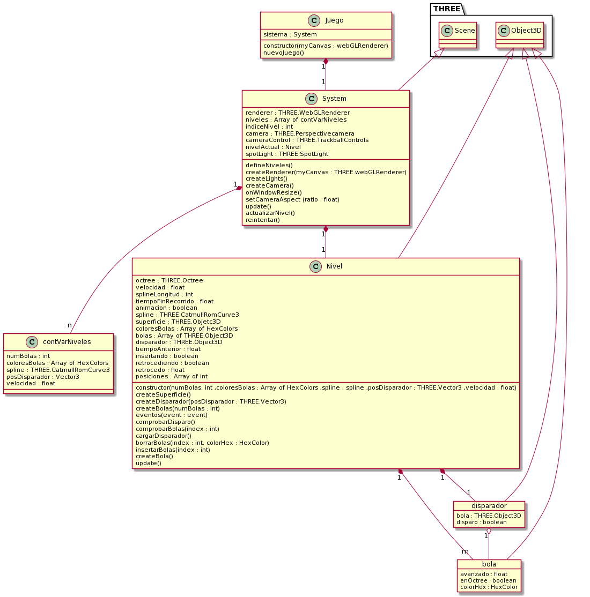
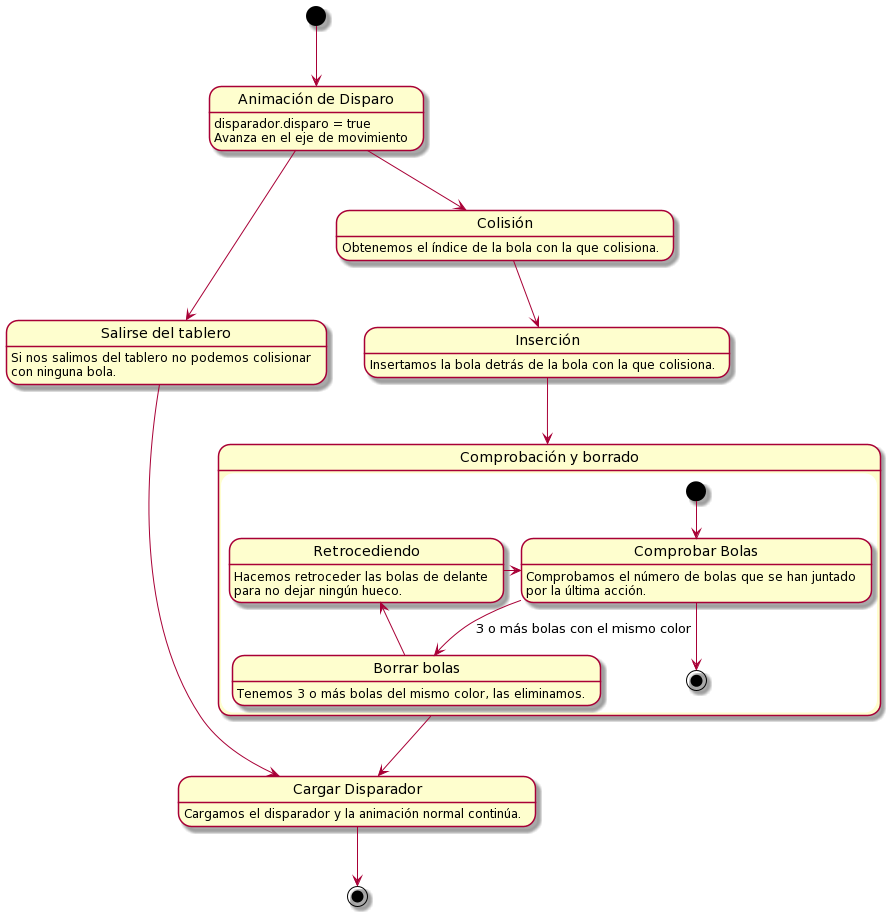

# Sistemas Gráficos : Práctica 2

**Autores:**
- Laura Gómez Garrido
- Juan Manuel Rubio Rodríguez

## Introducción

En esta práctica hemos tratado de replicar un juego web que funcionara de forma similar al conocido juego para móvil *Jungle Marble Blast*. Juego por niveles en que nuestro objetivo será destruir todas las bolas que recorren un determinado camino antes de que estas lleguen al final.

Para ello, nos valdremos de la biblioteca *THREE.js* y de *Octree.js*, proporcionadas para el desarrollo de la asignatura.

Las pruebas del juego han sido realizadas utilizando Ubuntu 20.04 LTS y hemos comprobado que existe grandes diferencias de rendimiento entre utilizar el navegador Firefox o Google Chrome. En nuestro caso, en Google Chrome funciona de una forma mucho más fluida y el tiempo de carga, desde que le damos a iniciar juego o a reintentar hasta que finalmente lo jugamos, es significativamente menor.

## Diseño de la aplicación

Primero de todo, nos encontramos con la clase **Juego**, la cual será esencial para poder renderizar correctamente nuestro juego en el div asignado y para poder aplicar algunas interacciones con el usuario mediante un botón para comenzar el juego y otro para reintentar jugar en caso de haber perdido la partida o finalizado todos y cada uno de los niveles.

Para mostrar u ocultar estos elementos html utilizaremos la propia clase Juego y la función *displayEndGame* que viene aportada en el archivo *display.js*. También debemos de tener en cuenta la función *siguienteNivel* gracias a la cual podemos mandarle una señal a nuestra clase **Juego** desde **Nivel** para indicarle que este ha sido finalizado y podemos avanzar al siguiente.

Dicho esto, mostramos las clases y objetos en concreto que hemos utilizado para el desarrollo de nuestra práctica así como las relaciones entre ellos.

Nótese **Juego**, **System**, **Nivel** y **contVarNiveles** son clases que han sido creadas de forma explícita en nuestro código mientras que **disparador** y **bola** son **THREE.Object3D** a los que simplemente les hemos añadido unas variables extras, algo permitido por el lenguaje en concreto que estamos utilizando.

También, debemos de indicar que "HexColor" no es más que un String. Hemos decidido ponerlo con este nombre en el diagrama de clases únicamente para indicar que no nos vale un String cualquiera sino que este debe de representar un color en código hexadecimal que pueda ser leído por javascript.

## Evento disparar
Los distintos eventos y estados por los que se mueve nuestra aplicación no suelen disponer de mayor dificultad y se pueden seguir con facilidad siguiendo una lectura del código. Por ejemplo, no es complicado ver que una vez iniciado el juego al pulsar el botón correspondiente nuestro **Juego** notifica a **System** para cree la escena y arranque el **Nivel** que queremos jugar.

Sin embargo, esto no es tan sencillo seguir las mecánicas y los razonamientos seguidos una vez que hemos disparado la bola hasta que podamos volver a disparar la siguiente. Para poder explicarlo de forma resumida y visual, adjuntamos el siguiente diagrama de estados producido por dicho evento:

## Posibles mejoras en un futuro:
- Creación de nuevos niveles
- Coordinar las dificultades de nuestros niveles para que no sean excesivamente complicados.
- Solucionar los bugs que puedan encontrarse a largo plazo.
- Creación de elementos decorativos. Esto ha sido dejado como algo extra puesto que se trata de algo ya evaluado en la práctica  y hemos decidido centrarnos en las nuevas herramientas aprendidas.
